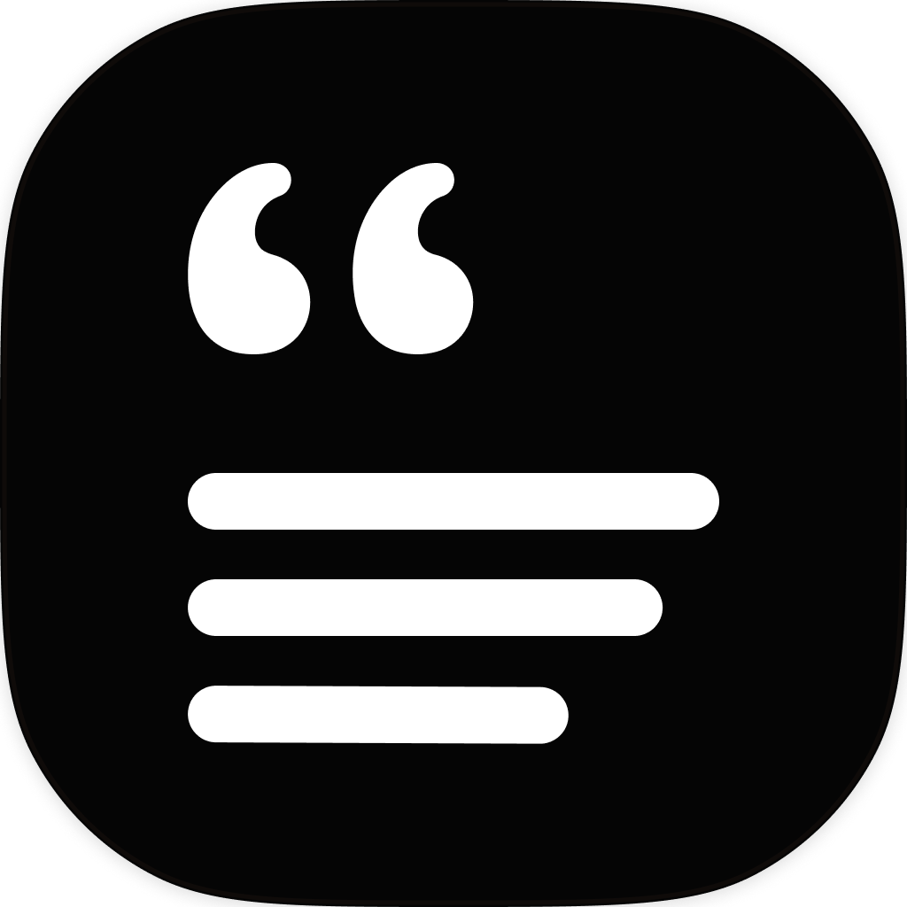
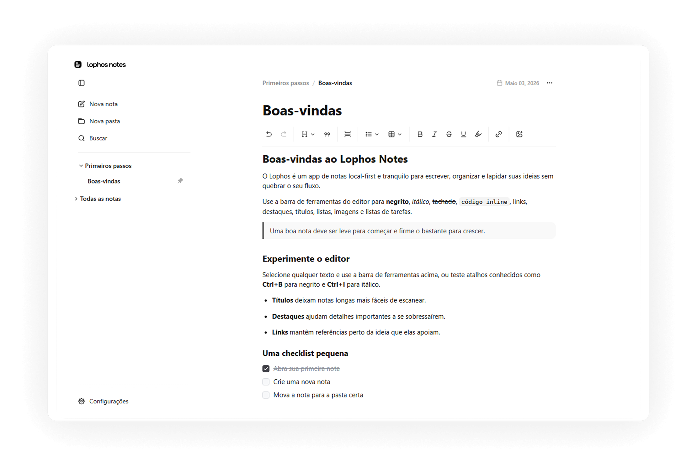
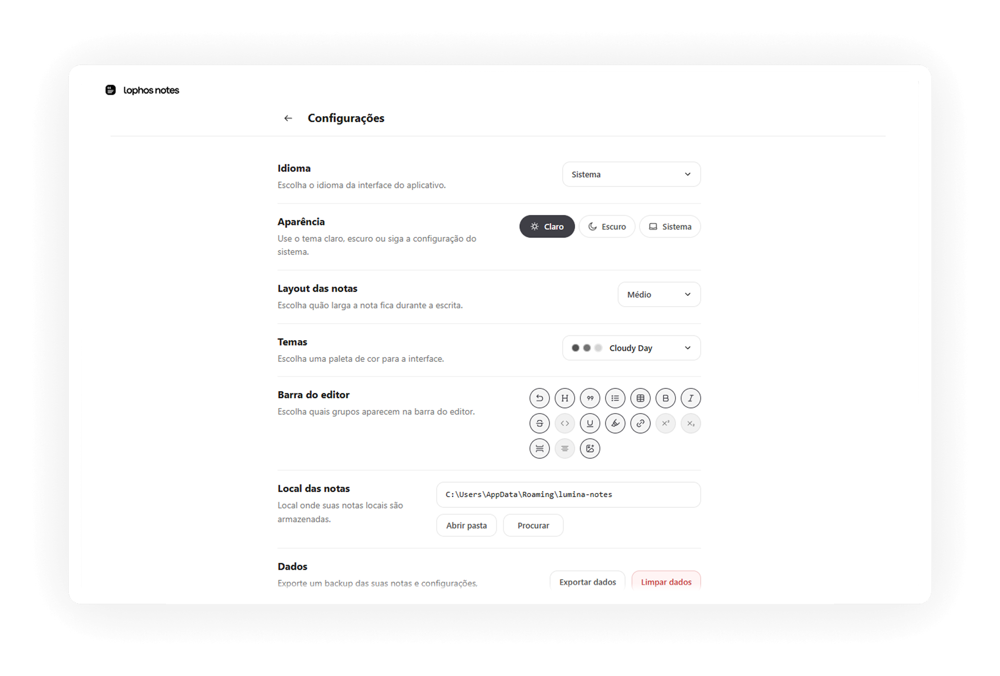
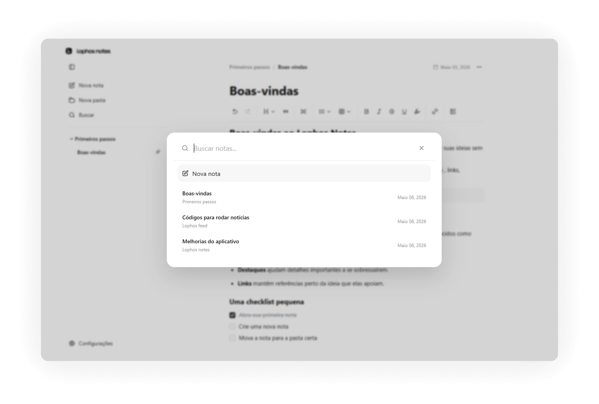
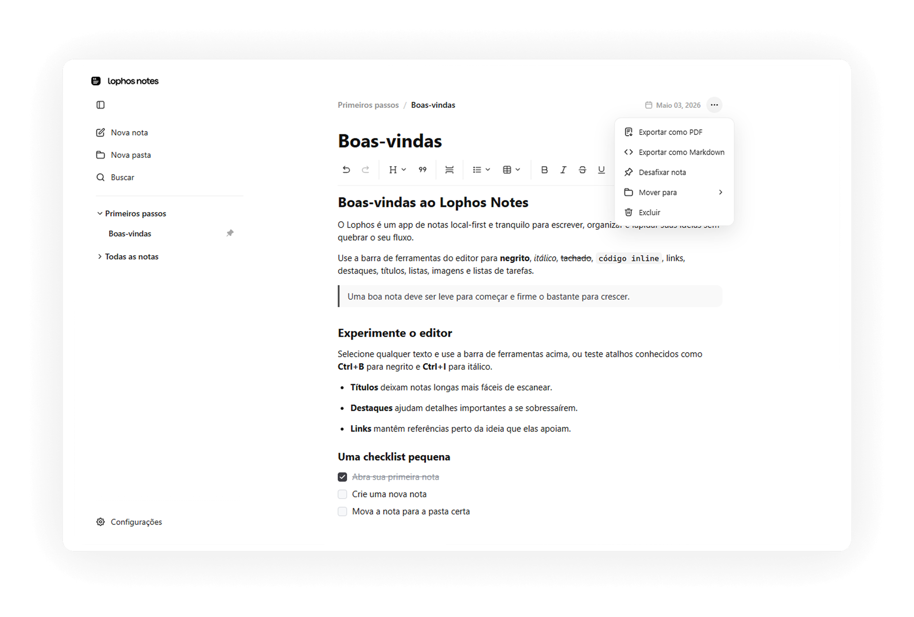

<div align="center">
  

  <h1>Lophos Notes</h1>
  <p>
    Um app desktop de notas com foco em escrita calma, organização local e uma interface polida para uso diário.
  </p>

  <p>
    
    
    
    
    
    
  </p>
</div>

## Sobre o projeto

O Lophos Notes nasceu como um app de notas com foco em refinamento visual, escrita fluida e uma base desktop moderna em Electron, React, Vite e TypeScript.

Hoje o projeto já entrega uma experiência local-first bem sólida: editor rico com TipTap, organização por pastas, busca interna, exportação, personalização de aparência e empacotamento `appx` preparado para distribuição na Microsoft Store.

## Highlights

- Escrita local-first com persistência em disco e diretório de notas configurável.
- Editor rico com headings, listas, task lists, tabelas, links, highlight, imagens, subscript, superscript e code block.
- Organização por pastas, notas fixadas, criação rápida e fluxo de navegação pensado para reduzir atrito.
- Busca interna com atalho `Ctrl+F` / `Cmd+F`.
- Exportação de notas para Markdown e PDF, além de exportação completa dos dados em JSON.
- Aparência `light`, `dark` e `system`, com temas visuais e largura da nota configurável.
- Interface localizada em `pt-BR` e `en-US`.
- Fluxo de build voltado para Windows com geração de assets e pacote `appx`.

## Screenshots

<p align="center">
  
  
</p>
<p align="center">
  
  
</p>

- `Print01`: visão principal do editor com sidebar, toolbar rica e onboarding.
- `Print02`: painel de configurações com idioma, aparência, temas, layout e dados.
- `Print03`: modal de busca para navegação rápida entre notas.
- `Print04`: ações da nota, incluindo exportação e organização.

## Built With

- [Electron](https://www.electronjs.org/)
- [React](https://react.dev/)
- [TypeScript](https://www.typescriptlang.org/)
- [Vite](https://vitejs.dev/)
- [TipTap](https://tiptap.dev/)
- [electron-builder](https://www.electron.build/)

## Getting Started

### Pré-requisitos

- Node.js 20+ recomendado
- npm
- Windows, se você quiser validar o pacote `appx`

### Instalação

```bash
git clone <url-do-repositorio>
cd notes
cmd /c npm install
```

### Rodando em desenvolvimento

```bash
cmd /c npm run dev
```

O script de desenvolvimento sobe o build do renderer em modo watch, recompila o processo principal do Electron e abre o app com um perfil local isolado em `.electron-dev`.

### Gerando build

```bash
cmd /c npm run build
```

Esse fluxo:

1. gera os assets do AppX;
2. faz o build do renderer com Vite;
3. compila o processo principal do Electron;
4. empacota o app com `electron-builder`.

## O que já está no app

### Escrita e edição

- Toolbar configurável
- Tabelas e task lists
- Upload e alinhamento de imagem
- Destaque, links, blockquote e code block
- Ajustes tipográficos como subscript e superscript

### Organização e navegação

- Pastas customizadas
- Notas fixadas
- Modal de busca
- Menus contextuais para mover, excluir e exportar

### Dados e desktop

- Persistência local em arquivo
- Escolha do diretório das notas
- Exportação para JSON, Markdown e PDF
- Tratamento dedicado para runtime Electron e build distribuível

## Estrutura

```text
.
|-- electron/     # processo principal e preload
|-- scripts/      # automações de dev e build
|-- src/
|   |-- components/
|   |   |-- editor/
|   |   |-- modals/
|   |   |-- settings/
|   |   '-- sidebar/
|   |-- extensions/
|   '-- ...
|-- assets/       # branding e ícones
|-- build/        # assets do AppX
|-- CHANGELOG.md
`-- README.md
```

## Roadmap

- Persistir notas em um formato mais robusto, com opção de arquivos locais organizados ou banco embarcado.
- Ampliar o onboarding visual com screenshots reais do produto.
- Evoluir a experiência de anexos, mídia e blocos ricos.
- Refinar fluxo de distribuição e publicação na Microsoft Store.
- Expandir a camada de testes para renderer, integrações do Electron e exportação.

## Changelog

O histórico recente de evolução do projeto está em [CHANGELOG.md](./CHANGELOG.md).

## Licença

Distribuído sob a licença MIT. Veja [LICENSE](./LICENSE).
